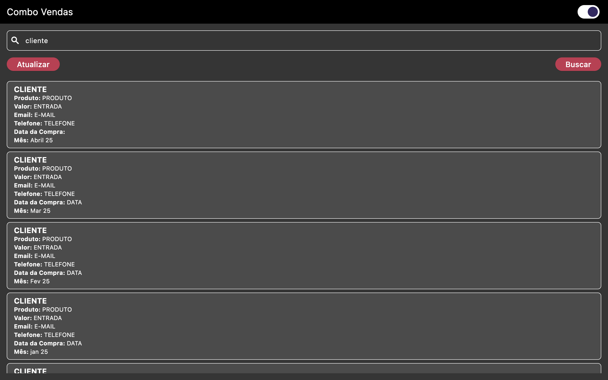
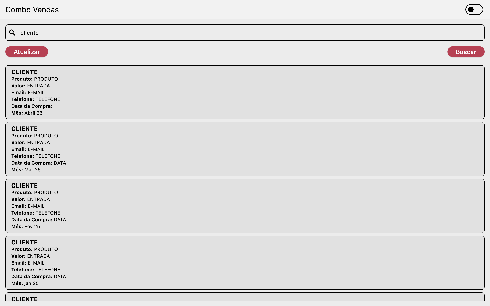
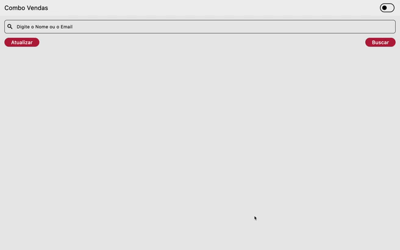

<!-- Logo do Projeto -->

  

# Combo Search - Encontrando Clientes com Eficiência

O **Combo Search** é uma aplicação desenvolvida para solucionar um problema real dentro de uma empresa que lidava com a venda de combos de instrutores e materiais didáticos. Ao longo dos anos, a planilha de controle cresceu exponencialmente, tornando **lenta e difícil** a busca por dados relevantes de compradores, como últimas compras ou elegibilidade para descontos de renovação.

---

## 💡 O Problema

- Toda a gestão era feita via **Google Sheets**, com mais de 36 abas acumuladas.
- Encontrar a **última compra de um cliente** levava até **10 minutos ou mais**, exigindo buscas manuais.
- Isso impactava diretamente o atendimento e a tomada de decisões sobre descontos e elegibilidade.

---

## 🚀 A Solução

Criei um sistema multiplataforma usando **Flutter** que:

- Consulta inicialmente os dados da planilha do Google via **API oficial do Google Sheets**
- Armazena os dados localmente com **SQLite (sqflite)** para buscas rápidas
- Usa **Provider** para gerenciamento de estado e reatividade
- Funciona **offline**, inclusive em **smartphones**
- Reduziu o tempo de resposta de **10 minutos para instantâneo**

---

## ⚙️ Tecnologias Utilizadas

- 🛠️ Flutter (UI Multiplataforma)
- 🧠 Provider (State Management)
- 📦 Sqflite (Banco de dados local)
- 🌐 Google Sheets API
- 📱 Multiplataforma (Desktop e Mobile)

---

## ✨ Resultado Final

Com o Combo Search, a busca por clientes antigos ou ativos se tornou **instantânea** e extremamente confiável, solucionando um gargalo que já era parte do dia a dia, mas **não era percebido como um problema até que fosse resolvido**. A aplicação demonstra como **um bom analista e solucionador de problemas** pode transformar operações com ferramentas inteligentes, sem depender de grandes investimentos.

---

## 📷 Imagens

### Modo Escuro

### Modo Claro

---

## 🎥 Preview da Aplicação

---

## 🧠 Considerações Finais

Este projeto nasceu da observação de um problema real e da busca por uma solução eficaz. Ele representa o tipo de transformação silenciosa, mas poderosa, que um bom desenvolvedor pode causar em uma empresa — **melhorando fluxos, reduzindo tempo e aumentando a produtividade**.

---

**Desenvolvido com dedicação, observação e foco em resultado.**  
_“Automatizar processos é enxergar onde ninguém viu problema — e resolver antes que virem um.”_

---

